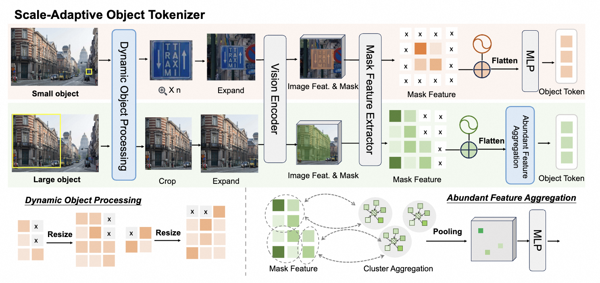

<p align="center">
    
<p>

<h3 align="center"><a href="http://arxiv.org/abs/2510.23603" style="color:#4D2B24">
PixelRefer: A Unified Framework for Spatio-Temporal Object Referring with Arbitrary Granularity</a></h3>

<div align=center>

 
[](https://arxiv.org/abs/2510.23603) 
[](https://huggingface.co/datasets/DAMO-NLP-SG/VideoRefer-700K) 
[](https://huggingface.co/collections/Alibaba-DAMO-Academy/pixelrefer) 
[](https://huggingface.co/datasets/DAMO-NLP-SG/VideoRefer-Bench) 


[](https://circleradon.github.io/PixelRefer/) 
[](https://huggingface.co/spaces/lixin4ever/PixelRefer) 
</div>


## 📰 News
* **[2025.10.28]** 🔥We release PixelRefer.


## 🏅 Results
<p align="center">
    
<p>

**Quantitative Evaluation** and **Efficiency Analysis**. 

**(a) Performance Comparison:** PixelRefer and PixelRefer-Lite consistently outperform
state-of-the-art object-level MLLMs across diverse image and video benchmarks. 

**(b) Data Efficiency:** Our method achieves leading performance with fewer training samples compared to existing methods. 

**(c) Runtime and Memory Efficiency:** PixelRefer-Lite notably reduces inference time and memory usage, clearly demonstrating its efficiency

## Model

<p align="center">
    
<p>

Frameworks of two complementary paradigms for region-level representations: 

- (a) Vision-Object Framework
- (b) Object-Only Framework.

<p align="center">
    
<p>


## 🌏 Model Zoo
| Model Name      | Visual Encoder | Language Decoder | 
|:----------------|:----------------|:------------------|
| [PixelRefer-7B](https://huggingface.co/Alibaba-DAMO-Academy/PixelRefer-7B) | [VL3-SigLIP-NaViT](https://huggingface.co/DAMO-NLP-SG/VL3-SigLIP-NaViT) | [Qwen2.5-7B-Instruct](https://huggingface.co/Qwen/Qwen2.5-7B-Instruct) |
| [PixelRefer-2B](https://huggingface.co/Alibaba-DAMO-Academy/PixelRefer-2B) | [VL3-SigLIP-NaViT](https://huggingface.co/DAMO-NLP-SG/VL3-SigLIP-NaViT) | [Qwen2.5-1.5B-Instruct](https://huggingface.co/Qwen/Qwen2.5-1.5B-Instruct) |
| [PixelRefer-Lite-7B](https://huggingface.co/Alibaba-DAMO-Academy/PixelRefer-Lite-7B) | [VL3-SigLIP-NaViT](https://huggingface.co/DAMO-NLP-SG/VL3-SigLIP-NaViT) | [Qwen2.5-7B-Instruct](https://huggingface.co/Qwen/Qwen2.5-7B-Instruct) |
| [PixelRefer-Lite-2B](https://huggingface.co/Alibaba-DAMO-Academy/PixelRefer-Lite-2B) | [VL3-SigLIP-NaViT](https://huggingface.co/DAMO-NLP-SG/VL3-SigLIP-NaViT) | [Qwen2.5-1.5B-Instruct](https://huggingface.co/Qwen/Qwen2.5-1.5B-Instruct) |


## 👾 Quick Start

### CookBook
Please refer to the examples in [notebooks](./notebooks) for detailed instructions on how to use our model for image and video inference.

| Model                    | Notebook                                                                                     | Description                                                                                                       |
|--------------------------|----------------------------------------------------------------------------------------------|-------------------------------------------------------------------------------------------------------------------|
| PixelRefer  | [image.ipynb](./notebooks/pixelrefer-infer-image.ipynb)                          | Demonstrations of using PixelRefer for **image object understanding**.                               |
| PixelRefer  | [video.ipynb](./notebooks/pixelrefer-infer-image.ipynb)                          | Demonstrations of using PixelRefer for **video object understanding**.                               |


For better usage, the demo integrates with [SAM2](https://github.com/facebookresearch/sam2), to get started, please install SAM2 first:

```shell
git clone https://github.com/facebookresearch/sam2.git && cd sam2

SAM2_BUILD_CUDA=0 pip install -e ".[notebooks]"
```
Then, download [sam2.1_hiera_large.pt](https://dl.fbaipublicfiles.com/segment_anything_2/092824/sam2.1_hiera_large.pt) to `checkpoints`.


## 🤗 Demo
<p align="center">
    
<p>

<p align="center">
    
<p>

### Online demo

Our [demo](https://huggingface.co/spaces/lixin4ever/PixelRefer) is hosted on Huggingface Spaces.

### Offline demo

1. Install Segment Anything:
```
pip install segment-anything
```
2. Run `app.py`
```
cd PixelRefer
python demo/app.py
```

## 🚀Training
1. Convert HF checkpoint:

```bash
# 2B
python scripts/convert_hf_checkpoint.py --model_path DAMO-NLP-SG/VideoLLaMA3-2B --save_path checkpoints/videollama3_2b_local

# 7B
python scripts/convert_hf_checkpoint.py --model_path DAMO-NLP-SG/VideoLLaMA3-7B --save_path checkpoints/videollama3_7b_local
```


2. Trining Data:
<p align="center">
    
<p>

Trining Data Structure:
```
├── data
│   ├── MeViS
|   |   └── JPEGImages/
│   ├── VOCdevkit
|   |   └── VOC2010/
│   ├── HC-STVG
|   |   └── video_parts/
│   ├── PartImageNet
|   |   └── images/
│   ├── coco
|   |   ├── train2017/
│   ├── VG
|   |   ├── VG_100K/
|   |   └── VG_100K_2/
│   ├── SA-1B
|   |   └── raw/
│   ├── SA-V
|   |   └── SA-V/
│   ├── Panda70M
|   |   ├── part3/
|   |   └── part4/
│   ├── mapilary
|   |   └── training/
│   ├── OpenImages
|   |   └── images/
│   ├── A2D-Sentenses
|   |   └── Release/
│   ├── Refer-YouTube-VOS
|   |   └── train/
│   ├── VCR
|   |   └── vcr1images/
│   └── LLaVA-Video-178K

```

### PixelRefer
We provide our training data in [stage1.json](https://huggingface.co/datasets/Alibaba-DAMO-Academy/PixelRefer-TrainingData/resolve/main/PixelRefer_stage1_trainingdata.json?download=true) and [stage2.json](https://huggingface.co/datasets/Alibaba-DAMO-Academy/PixelRefer-TrainingData/resolve/main/PixelRefer_stage2_trainingdata.json?download=true).

In the current version, we only support `sinlge mask` per object. Please organize the training data in the following format:
```json
[
    {
        "video": "videos/xxx.mp4",
        "conversations": [
            {
                "from": "human",
                "value": "<video>\nWhat is the relationship of <region> and <region>?"
            },
            {
                "from": "gpt",
                "value": "...."
            },
            ...
        ],
        "masks":[
            //object1
            {
                "frame_idx":{
                    //rle format or polygon
                }
            },
            //object2
            {
                "frame_idx":{
                    //rle format or polygon
                }
            },
            ...
        ]

    },
    {
        "image": "images/xxx.jpg",
        "conversations": [
            {
                "from": "human",
                "value": "<image>\nWhat is the relationship of <region> and <region>?"
            },
            {
                "from": "gpt",
                "value": "...."
            },
            ...
        ],
        "masks":[
            //object1
            {
                //rle format or polygon
            },
            //object2
            {
                 //rle format or polygon
            },
            ...
        ],
        "width": xx, //necessary for polygon
        "height": xx, //necessary for polygon
    }
]
```

### PixelRefer-Lite
We provide our training data in [stage1.json](https://huggingface.co/datasets/Alibaba-DAMO-Academy/PixelRefer-TrainingData/resolve/main/PixelRefer-Lite_stage1_trainingdata.json?download=true) and [stage2.json](https://huggingface.co/datasets/Alibaba-DAMO-Academy/PixelRefer-TrainingData/resolve/main/PixelRefer-Lite_stage2_trainingdata.json?download=true).

For PixelRefer-Lite, `multiple masks` per object are provided. 

## ✅ Evaluation

See [evaluation](./evaluation) for details.


## 📑 Citation

If you find PixelRefer useful for your research and applications, please cite using this BibTeX:
```bibtex
@article{yuan2025videorefersuite,
  title = {VideoRefer Suite: Advancing Spatial-Temporal Object Understanding with Video LLM},
  author = {Yuqian Yuan, Hang Zhang, Wentong Li, Zesen Cheng, Boqiang Zhang, Long Li, Xin Li, Deli Zhao, Wenqiao Zhang, Yueting Zhuang, Jianke Zhu, Lidong Bing},
  journal={arXiv},
  year={2025},
  url = {http://arxiv.org/abs/2501.00599}
}
```

## 👍 Acknowledgement
The codebase of PixelRefer is adapted from [**VideoLLaMA 3**](https://github.com/DAMO-NLP-SG/VideoLLaMA3).