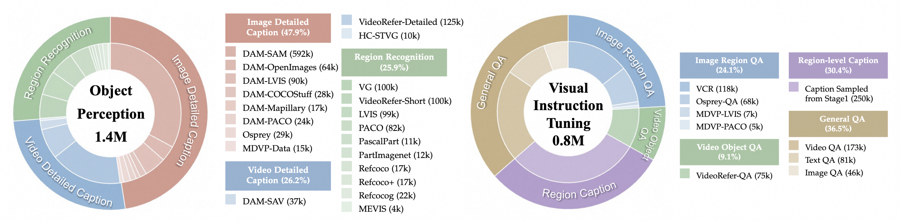

<p align="center">
    
<p>

<div align=center>

 
[](http://arxiv.org/abs/2501.00599) 
[](http://arxiv.org/abs/2501.00599) 
[](https://huggingface.co/datasets/DAMO-NLP-SG/VideoRefer-700K) 
[](https://huggingface.co/datasets/DAMO-NLP-SG/VideoRefer-Bench) 


[](https://circleradon.github.io/PixelRefer/) 
[](https://huggingface.co/spaces/lixin4ever/PixelRefer) 
[](https://www.youtube.com/watch?v=gLNOj1OPFJE)
</div>

<p align="center">
  
  
</p>


<p align="center">
    
<p>

<p align="center" style="margin-bottom: 5px;">
  PixelRefer can understand any object you're interested within a video.
</p>


## 📰 News
* **[2025.10.28]** 🔥We release a new version, [PixelRefer](./PixelRefer/).
* **[2025.6.19]** 🔥We release the [demo](https://huggingface.co/spaces/lixin4ever/VideoRefer-VideoLLaMA3) of VideoRefer-VideoLLaMA3, hosted on HuggingFace. Feel free to try it!
* **[2025.6.18]** 🔥We release a new version, [VideoRefer-VideoLLaMA3](./videorefer_videollama3)([VideoRefer-VideoLLaMA3-7B](https://huggingface.co/DAMO-NLP-SG/VideoRefer-VideoLLaMA3-7B) and [VideoRefer-VideoLLaMA3-2B](https://huggingface.co/DAMO-NLP-SG/VideoRefer-VideoLLaMA3-2B)), which are trained based on [VideoLLaMA3](https://github.com/DAMO-NLP-SG/VideoLLaMA3).
* **[2025.4.22]** 🔥Our VideoRefer-Bench has been adopted in [Describe Anything Model](https://arxiv.org/pdf/2504.16072) (NVIDIA & UC Berkeley).
* **[2025.2.27]** 🔥VideoRefer Suite has been accepted to CVPR2025!
* **[2025.2.18]**  🔥We release the [VideoRefer-700K dataset](https://huggingface.co/datasets/DAMO-NLP-SG/VideoRefer-700K) on HuggingFace.
* **[2025.1.1]**  🔥We release [VideoRefer](./videorefer/), including [VideoRefer-7B](https://huggingface.co/DAMO-NLP-SG/VideoRefer-7B) model, the code of VideoRefer and the [VideoRefer-Bench](https://huggingface.co/datasets/DAMO-NLP-SG/VideoRefer-Bench).

## 🚀 Performance
Performance on both region-level image and video benchmarks.
<p align="center">
    
<p>

🌟 **Highlights:**
- High performance
- Data Efficiency
- Runtime and Memory Efficiency


## 🤗 Huggingface Demo
The online demo is hosted on [Huggingface Spaces](https://huggingface.co/spaces/lixin4ever/VideoRefer-VideoLLaMA3/). 


## 🔍 About PixelRefer Series

`PixelRefer Series` is designed to enhance the fine-grained spatial-temporal understanding capabilities of Multimodal Large Language Models (Image&Video MLLMs). 
It consists of three primary components:

* **Model (VideoRefer & PixelRefer)**

- [PixelRefer](./PixelRefer/) is  a unified object referring framework for both image and video.
  We construct Vision-Object framework（a）and Object-Only framework（b）.

<p align="center">
    
<p>

We proposed Scale-Adaptive Object Tokenizer (SAOT) designed to generate accurate and informative object tokens across different scales.

<p align="center">
    
<p>

- [VideoRefer](./VideoRefer) enables fine-grained perceiving, reasoning, and retrieval for user-defined regions at any specified timestamps—supporting both single-frame and multi-frame region inputs.
<p align="center">
    
<p>


* **Dataset (PixelRefer-2.2M)**

`PixelRefer-2.2M` is a comprehensive collection of diverse, open-source image-level and video-level datasets. These datasets are systematically categorized into two main groups: **Foundational Object Perception**, which contains 1.4 million samples, and **Visual Instruction Tuning**, with 0.8 million samples.


<p align="center">
    
<p>


* **Benchmark (VideoRefer-Bench)**

`VideoRefer-Bench` is a comprehensive benchmark to evaluate the object-level video understanding capabilities of a model, which consists of two sub-benchmarks: **VideoRefer-Bench-D** and **VideoRefer-Bench-Q**.


<p align="center">
    
    
<p>


## 📑 Citation

If you find PixelRefer Series useful for your research and applications, please cite using this BibTeX:
```bibtex
@article{yuan2025pixelrefer,
  title     = {PixelRefer: A Unified Framework for Spatio-Temporal Object Referring with Arbitrary Granularity},
  author    = {Yuqian Yuan and Wenqiao Zhang and Xin Li and Shihao Wang and Kehan Li and Wentong Li and Jun Xiao and Lei Zhang and Beng Chin Ooi},
  year      = {2025},
  journal   = {arXiv},
}

@inproceedings{yuan2025videorefer,
  title     = {Videorefer Suite: Advancing Spatial-Temporal Object Understanding with Video LLM},
  author    = {Yuqian Yuan and Hang Zhang and Wentong Li and Zesen Cheng and Boqiang Zhang and Long Li and Xin Li and Deli Zhao and Wenqiao Zhang and Yueting Zhuang and others},
  booktitle = {Proceedings of the Computer Vision and Pattern Recognition Conference},
  pages     = {18970--18980},
  year      = {2025},
}
```


## 👍 Acknowledgement
The codebase of PixelRefer is adapted from [**VideoLLaMA 2**](https://github.com/DAMO-NLP-SG/VideoLLaMA2) and [**VideoLLaMA 3**](https://github.com/DAMO-NLP-SG/VideoLLaMA3).
