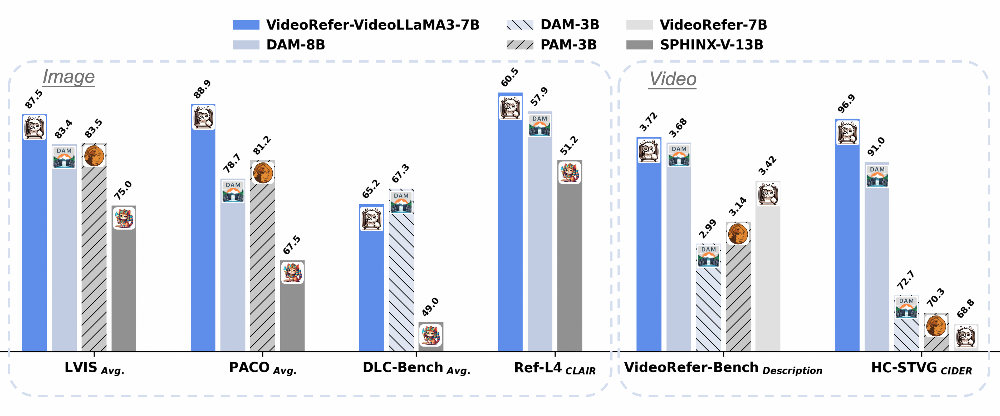
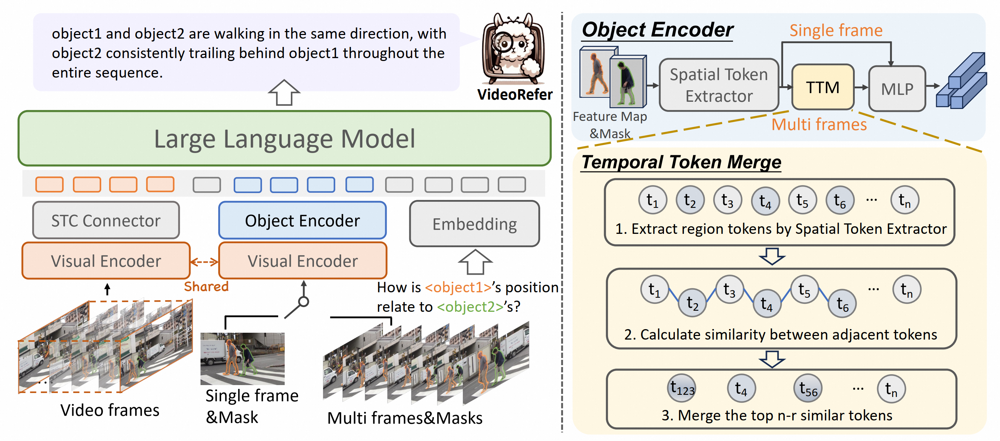
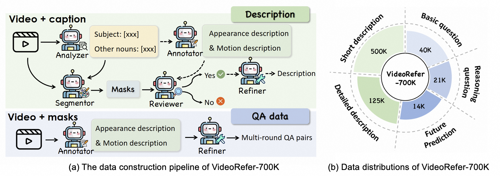
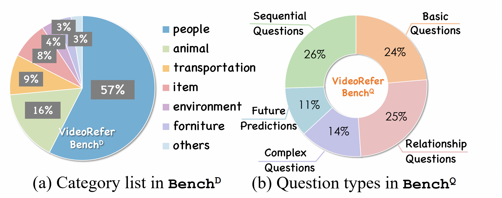

<p align="center">
    
<p>

<h3 align="center"><a href="http://arxiv.org/abs/2501.00599" style="color:#4D2B24">
VideoRefer Suite: Advancing Spatial-Temporal Object Understanding with Video LLM</a></h3>

<div align=center>

 
[](http://arxiv.org/abs/2501.00599) 
[](https://huggingface.co/datasets/DAMO-NLP-SG/VideoRefer-700K) 
[](https://huggingface.co/collections/DAMO-NLP-SG/videorefer-6776851a26815bf20dbd9564) 
[](https://huggingface.co/datasets/DAMO-NLP-SG/VideoRefer-Bench) 

[](https://www.youtube.com/watch?v=gLNOj1OPFJE)
[](https://damo-nlp-sg.github.io/VideoRefer/) 
[](https://huggingface.co/spaces/lixin4ever/VideoRefer-VideoLLaMA3/) 
</div>

<p align="center">
    
<p>

<p align="center" style="margin-bottom: 5px;">
  VideoRefer can understand any object you're interested within a video.
</p>


## 📰 News
* **[2025.6.19]** 🔥We release the [demo](https://huggingface.co/spaces/lixin4ever/VideoRefer-VideoLLaMA3) of VideoRefer-VideoLLaMA3, hosted on HuggingFace. Feel free to try it!
* **[2025.6.18]** 🔥We release a new version, [VideoRefer-VideoLLaMA3](./videorefer_videollama3)([VideoRefer-VideoLLaMA3-7B](https://huggingface.co/DAMO-NLP-SG/VideoRefer-VideoLLaMA3-7B) and [VideoRefer-VideoLLaMA3-2B](https://huggingface.co/DAMO-NLP-SG/VideoRefer-VideoLLaMA3-2B)), which are trained based on [VideoLLaMA3](https://github.com/DAMO-NLP-SG/VideoLLaMA3).
* **[2025.4.22]** 🔥Our VideoRefer-Bench has been adopted in [Describe Anything Model](https://arxiv.org/pdf/2504.16072) (NVIDIA & UC Berkeley).
* **[2025.2.27]** 🔥VideoRefer Suite has been accepted to CVPR2025!
* **[2025.2.18]**  🔥We release the [VideoRefer-700K dataset](https://huggingface.co/datasets/DAMO-NLP-SG/VideoRefer-700K) on HuggingFace.
* **[2025.1.1]**  🔥We release [VideoRefer](./videorefer/), including [VideoRefer-7B](https://huggingface.co/DAMO-NLP-SG/VideoRefer-7B) model, the code of VideoRefer and the [VideoRefer-Bench](https://huggingface.co/datasets/DAMO-NLP-SG/VideoRefer-Bench).

## 🚀 Performance
Performance on both region-level image and video benchmarks.
<p align="center">
    
<p>

## 🤗 Huggingface Demo
The online demo (VideoRefer-VideoLLaMA3) is hosted on [Huggingface Spaces](https://huggingface.co/spaces/lixin4ever/VideoRefer-VideoLLaMA3/). 

The [YouTube Video](https://www.youtube.com/watch?v=iCoN1fxNI20) showcases a detailed video walkthrough of our online demo.


## 🎥 Video

https://github.com/user-attachments/assets/d943c101-72f3-48aa-9822-9cfa46fa114b

- HD video can be viewed on [YouTube](https://www.youtube.com/watch?v=gLNOj1OPFJE).


## 🔍 About VideoRefer Suite 

`VideoRefer Suite` is designed to enhance the fine-grained spatial-temporal understanding capabilities of Video Large Language Models (Video LLMs). 
It consists of three primary components:

* **Model (VideoRefer)**

`VideoRefer` is an effective Video LLM, which enables fine-grained perceiving, reasoning, and retrieval for user-defined regions at any specified timestamps—supporting both single-frame and multi-frame region inputs.

<p align="center">
    
<p>


* **Dataset (VideoRefer-700K)**

`VideoRefer-700K` is a large-scale, high-quality object-level video instruction dataset. Curated using a sophisticated multi-agent data engine to fill the gap for high-quality object-level video instruction data.

<p align="center">
    
<p>


* **Benchmark (VideoRefer-Bench)**

`VideoRefer-Bench` is a comprehensive benchmark to evaluate the object-level video understanding capabilities of a model, which consists of two sub-benchmarks: **VideoRefer-Bench-D** and **VideoRefer-Bench-Q**.

<p align="center">
    
<p>


## 🛠️ Requirements and Installation
Basic Dependencies:
* Python >= 3.8
* Pytorch >= 2.2.0
* CUDA Version >= 11.8
* transformers == 4.40.0 (for reproducing paper results)
* tokenizers == 0.19.1

Install required packages:
```bash
git clone https://github.com/DAMO-NLP-SG/VideoRefer
cd VideoRefer
pip install -r requirements.txt
pip install flash-attn --no-build-isolation
```

## 🌟 Getting started

Please refer to the examples in [notebooks](./notebooks) for detailed instructions on how to use our model for image and video inference.

| Model                    | Notebook                                                                                     | Description                                                                                                       |
|--------------------------|----------------------------------------------------------------------------------------------|-------------------------------------------------------------------------------------------------------------------|
| VideoRefer               | [single-object.ipynb](./notebooks/videorefer_infer-single-object.ipynb)                      | Demonstrations of using VideoRefer for **single object understanding** with both **single-frame mode** and **multi-frame mode**. |
| VideoRefer               | [multi-object.ipynb](./notebooks/videorefer_infer-multi-objects.ipynb)                       | Demonstrations of using VideoRefer for **multiple object question-answering** with both **single-frame mode** and **multi-frame mode**. |
| VideoRefer-VideoLLaMA3   | [image.ipynb](./notebooks/videorefer_videollama3-infer-image.ipynb)                          | Demonstrations of using VideoRefer-VideoLLaMA3 for **image object understanding**.                               |
| VideoRefer-VideoLLaMA3   | [video.ipynb](./notebooks/videorefer_videollama3-infer-video.ipynb)                          | Demonstrations of using VideoRefer-VideoLLaMA3 for **video object understanding**.                               |


For better usage, the demo integrates with [SAM2](https://github.com/facebookresearch/sam2), to get started, please install SAM2 first:

```shell
git clone https://github.com/facebookresearch/sam2.git && cd sam2

SAM2_BUILD_CUDA=0 pip install -e ".[notebooks]"
```
Then, download [sam2.1_hiera_large.pt](https://dl.fbaipublicfiles.com/segment_anything_2/092824/sam2.1_hiera_large.pt) to `checkpoints`.


## 🌏 Model Zoo
| Model Name      | Visual Encoder | Language Decoder | 
|:----------------|:----------------|:------------------|
| [VideoRefer-VideoLLaMA3-7B](https://huggingface.co/DAMO-NLP-SG/VideoRefer-VideoLLaMA3-7B) | [VL3-SigLIP-NaViT](https://huggingface.co/DAMO-NLP-SG/VL3-SigLIP-NaViT) | [Qwen2.5-7B-Instruct](https://huggingface.co/Qwen/Qwen2.5-7B-Instruct) |
| [VideoRefer-VideoLLaMA3-2B](https://huggingface.co/DAMO-NLP-SG/VideoRefer-VideoLLaMA3-2B) | [VL3-SigLIP-NaViT](https://huggingface.co/DAMO-NLP-SG/VL3-SigLIP-NaViT) | [Qwen2.5-1.5B-Instruct](https://huggingface.co/Qwen/Qwen2.5-1.5B-Instruct) |
| [VideoRefer-7B](https://huggingface.co/DAMO-NLP-SG/VideoRefer-7B) | [siglip-so400m-patch14-384](https://huggingface.co/google/siglip-so400m-patch14-384) | [Qwen2-7B-Instruct](https://huggingface.co/Qwen/Qwen2-7B-Instruct)  |
| [VideoRefer-7B-stage2](https://huggingface.co/DAMO-NLP-SG/VideoRefer-7B-stage2)  | [siglip-so400m-patch14-384](https://huggingface.co/google/siglip-so400m-patch14-384) | [Qwen2-7B-Instruct](https://huggingface.co/Qwen/Qwen2-7B-Instruct)  |
| [VideoRefer-7B-stage2.5](https://huggingface.co/DAMO-NLP-SG/VideoRefer-7B-stage2.5)  | [siglip-so400m-patch14-384](https://huggingface.co/google/siglip-so400m-patch14-384) | [Qwen2-7B-Instruct](https://huggingface.co/Qwen/Qwen2-7B-Instruct)  |


## 🖨️ VideoRefer-700K
The dataset can be accessed on [huggingface](https://huggingface.co/datasets/DAMO-NLP-SG/VideoRefer-700K).

By leveraging our multi-agent data engine, we meticulously create three primary types of object-level video instruction data: 
- Object-level Detailed Caption
- Object-level Short Caption
- Object-level QA

Video sources:
- Detailed&Short Caption
    - [Panda-70M](https://snap-research.github.io/Panda-70M/). 
- QA
    - [MeViS](https://codalab.lisn.upsaclay.fr/competitions/15094)
    - [A2D](https://web.eecs.umich.edu/~jjcorso/r/a2d/index.html#downloads)
    - [Youtube-VOS](https://competitions.codalab.org/competitions/29139#participate-get_data)

Data format:
```json
[
    {
        "video": "videos/xxx.mp4",
        "conversations": [
            {
                "from": "human",
                "value": "<video>\nWhat is the relationship of <region> and <region>?"
            },
            {
                "from": "gpt",
                "value": "...."
            },
            ...
        ],
        "annotation":[
            //object1
            {
                "frame_idx":{
                    "segmentation": {
                        //rle format or polygon
                    }
                }
                "frame_idx":{
                    "segmentation": {
                        //rle format or polygon
                    }
                }
            },
            //object2
            {
                "frame_idx":{
                    "segmentation": {
                        //rle format or polygon
                    }
                }
            },
            ...
        ]

    }
```

## 🕹️ VideoRefer-Bench

`VideoRefer-Bench` assesses the models in two key areas: Description Generation, corresponding to `VideoRefer-BenchD`, and Multiple-choice Question-Answer, corresponding to `VideoRefer-BenchQ`.

https://github.com/user-attachments/assets/33757d27-56bd-4523-92da-8f5a58fe5c85

- The annotations of the benchmark can be found in [🤗benchmark](https://huggingface.co/datasets/DAMO-NLP-SG/VideoRefer-Bench).

- The usage of VideoRefer-Bench is detailed in [doc](./benchmark/README.md).

- To evaluate general MLLMs on VideoRefer-Bench, please refer to [eval](./benchmark/evaluation_general_mllms.md).


## 📑 Citation

If you find VideoRefer Suite useful for your research and applications, please cite using this BibTeX:
```bibtex
@article{yuan2025videorefersuite,
  title = {VideoRefer Suite: Advancing Spatial-Temporal Object Understanding with Video LLM},
  author = {Yuqian Yuan, Hang Zhang, Wentong Li, Zesen Cheng, Boqiang Zhang, Long Li, Xin Li, Deli Zhao, Wenqiao Zhang, Yueting Zhuang, Jianke Zhu, Lidong Bing},
  journal={arXiv},
  year={2025},
  url = {http://arxiv.org/abs/2501.00599}
}
```

<details open><summary>💡 Some other multimodal-LLM projects from our team may interest you ✨. </summary><p>
<!--  may -->

> [**Video-LLaMA: An Instruction-tuned Audio-Visual Language Model for Video Understanding**](https://github.com/DAMO-NLP-SG/Video-LLaMA) <br>
> Hang Zhang, Xin Li, Lidong Bing <br>
[](https://github.com/DAMO-NLP-SG/Video-LLaMA)  [](https://github.com/DAMO-NLP-SG/Video-LLaMA) [](https://arxiv.org/abs/2306.02858) <br>

> [**VideoLLaMA 2: Advancing Spatial-Temporal Modeling and Audio Understanding in Video-LLMs**](https://github.com/DAMO-NLP-SG/VideoLLaMA2) <br>
> Zesen Cheng, Sicong Leng, Hang Zhang, Yifei Xin, Xin Li, Guanzheng Chen, Yongxin Zhu, Wenqi Zhang, Ziyang Luo, Deli Zhao, Lidong Bing <br>
[](https://github.com/DAMO-NLP-SG/VideoLLaMA2)  [](https://github.com/DAMO-NLP-SG/VideoLLaMA2) [](https://arxiv.org/abs/2406.07476) <br>

> [**VideoLLaMA 3: Frontier Multimodal Foundation Models for Image and Video Understanding**](https://github.com/DAMO-NLP-SG/VideoLLaMA3) <br>
> Boqiang Zhang, Kehan Li, Zesen Cheng, Zhiqiang Hu, Yuqian Yuan, Guanzheng Chen, Sicong Leng, Yuming Jiang, Hang Zhang, Xin Li, Peng Jin, Wenqi Zhang, Fan Wang, Lidong Bing, Deli Zhao <br>
[](https://github.com/DAMO-NLP-SG/VideoLLaMA3)  [](https://github.com/DAMO-NLP-SG/VideoLLaMA3) [](https://arxiv.org/abs/2501.13106) <br>

> [**Osprey: Pixel Understanding with Visual Instruction Tuning**](https://github.com/CircleRadon/Osprey) <br>
> Yuqian Yuan, Wentong Li, Jian Liu, Dongqi Tang, Xinjie Luo, Chi Qin, Lei Zhang, Jianke Zhu <br>
[](https://github.com/CircleRadon/Osprey)  [](https://github.com/CircleRadon/Osprey) [](https://arxiv.org/abs/2312.10032) <br>

</p></details>


## 👍 Acknowledgement
The codebase of VideoRefer is adapted from [**VideoLLaMA 2**](https://github.com/DAMO-NLP-SG/VideoLLaMA2) and [**VideoLLaMA 3**](https://github.com/DAMO-NLP-SG/VideoLLaMA3).