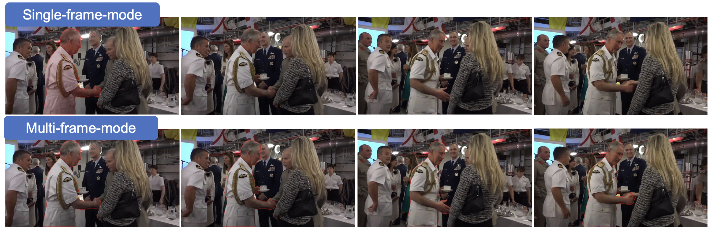
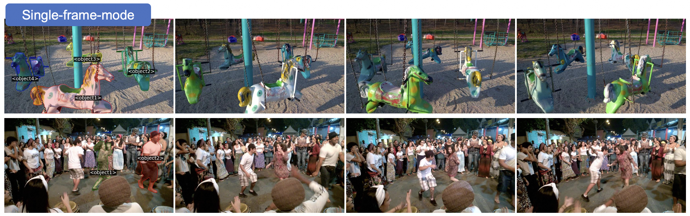

# Evaluation for general MLLMs on VideoRefer-Bench

This document provides a guide on how to evaluate a general MLLM on VideoRefer-Bench.

## 1. VideoRefer-Bench-D

We use [set-of-mark](https://github.com/microsoft/SoM) method to apply masks to video frames, sampling `16 frames` from each video.

### Data Preprocessing

First, instal [detectron2](https://github.com/facebookresearch/detectron2) using the following commands:
```bash
python -m pip install 'git+https://github.com/facebookresearch/detectron2.git'

# Or, to install it from a local clone:
git clone https://github.com/facebookresearch/detectron2.git
python -m pip install -e detectron2
```

single-frame mode:
```bash
cd benchmark
python description_add_mask_first_frame.py \
--json-path eval/VideoRefer-Bench-D/VideoRefer-Bench-D.json \
--video_path eval/VideoRefer-Bench-D/Panda-70M-part/ \
--save-dir eval/VideoRefer-Bench-D/masked-first-frame
```

multi-frame mode:
```bash
python description_add_mask_all_frame.py \
--json-path eval/VideoRefer-Bench-D/VideoRefer-Bench-D.json \
--video_path eval/VideoRefer-Bench-D/Panda-70M-part/ \
--save-dir eval/VideoRefer-Bench-D/masked-all-frame
```

After generating the data, it will resemble the following image:

<p align="center">
    
<p>

### Prompt used for evaluation

- single-frame-mode
```
I have outlined an object with a red contour in the first frame in the video. Please describe the object in the entire video in detail.
```

- multi-frame-mode:
```
I have outlined an object with a red contour in the video. Please describe the object in detail.
```

### Evaluation example (Qwen2vl)
```
bash benchmark/eval_videorefer-bench-d_qwen2vl.sh
```

## 2. VideoRefer-Bench-Q

We use [set-of-mark](https://github.com/microsoft/SoM) method to apply masks to video frames, sampling 16 frames from each video.

### Data Preprocessing

First, instal [detectron2](https://github.com/facebookresearch/detectron2) using the following commands:
```bash
python -m pip install 'git+https://github.com/facebookresearch/detectron2.git'

# Or, to install it from a local clone:
git clone https://github.com/facebookresearch/detectron2.git
python -m pip install -e detectron2
```

single-frame mode:
```
python qa_add_mask_first_frame.py \
--json-path eval/VideoRefer-Bench-Q/VideoRefer-Bench-Q.json \
--video_path eval/VideoRefer-Bench-Q \
--save-dir eval/VideoRefer-Bench-Q/masked-first-frame
```

After generating the data, it will resemble the following image:

<p align="center">
    
<p>


### Prompt used for evaluation

```python
import json
import os
import re
data = json.load(open('VideoRefer-Bench-Q.json'))
final_data = []
for i, d in enumerate(tqdm(data)):
    video_frames = os.listdir()
    video_files = sorted(frame_list, key=lambda f: int(f.split('/')[-1].split('.')[0]))

    matches = re.findall(r'<object(\d+)>', d['Question'])
    colors = ['red', 'green', 'yellow', 'blue', 'grey', 'purple', 'orange', 'brown', 'pink']
    color_str = ''
    for i, obj in enumerate(matches):
        if i!=0:
            color_str += f'; <object{obj}>: {colors[i]}'
        else:
            color_str += f'<object{obj}>: {colors[i]}'
    color_str += '.'

    prompt = 'I have highlighted an object using a colored mask in the first frame it occurs in the video. ' + color_str
    prompt += d['Question'].replace('<region>','')
    prompt += ' '.join(d['options'])
    prompt += '. Answer with the option\'s letter from the given choices directly.'
```

### Evaluation example (Qwen2vl)
```
bash benchmark/eval_videorefer-bench-d_qwen2vl.sh
```
