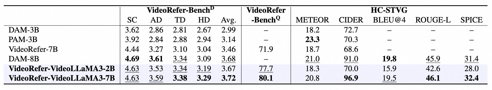

<p align="center">
    
<p>

<h3 align="center"><a href="http://arxiv.org/abs/2501.00599" style="color:#4D2B24">
VideoRefer Suite: Advancing Spatial-Temporal Object Understanding with Video LLM</a></h3>

<div align=center>

 
[](http://arxiv.org/abs/2501.00599) 
[](https://huggingface.co/datasets/DAMO-NLP-SG/VideoRefer-700K) 
[](https://huggingface.co/collections/DAMO-NLP-SG/videorefer-6776851a26815bf20dbd9564) 
[](https://huggingface.co/datasets/DAMO-NLP-SG/VideoRefer-Bench) 

[](https://www.youtube.com/watch?v=gLNOj1OPFJE)
[](https://damo-nlp-sg.github.io/VideoRefer/) 
[](https://huggingface.co/spaces/lixin4ever/VideoRefer-VideoLLaMA3/) 
</div>


## 📰 News
* **[2025.6.19]** 🔥We release the [demo](https://huggingface.co/spaces/lixin4ever/VideoRefer-VideoLLaMA3) of VideoRefer-VideoLLaMA3, hosted on HuggingFace. Feel free to try it!
* **[2025.6.18]** 🔥We release a new version, [VideoRefer-VideoLLaMA3](./videorefer_videollama3)([VideoRefer-VideoLLaMA3-7B](https://huggingface.co/DAMO-NLP-SG/VideoRefer-VideoLLaMA3-7B) and [VideoRefer-VideoLLaMA3-2B](https://huggingface.co/DAMO-NLP-SG/VideoRefer-VideoLLaMA3-2B)), which are trained based on [VideoLLaMA3](https://github.com/DAMO-NLP-SG/VideoLLaMA3).

## 🏅 Results
<p align="center">
    
<p>

<details>
  <summary>💡Click here to show detailed performance on image benchmarks</summary>
  
</details>

<details>
  <summary>💡Click here to show detailed performance on video benchmarks</summary>
  
</details>

## 👾 Quick Start
```
python videorefer_videollama3/infer.py
```

### CookBook
Please refer to the examples in [notebooks](./notebooks) for detailed instructions on how to use our model for image and video inference.

| Model                    | Notebook                                                                                     | Description                                                                                                       |
|--------------------------|----------------------------------------------------------------------------------------------|-------------------------------------------------------------------------------------------------------------------|
| VideoRefer-VideoLLaMA3   | [image.ipynb](./notebooks/videorefer_videollama3-infer-image.ipynb)                          | Demonstrations of using VideoRefer-VideoLLaMA3 for **image object understanding**.                               |
| VideoRefer-VideoLLaMA3   | [video.ipynb](./notebooks/videorefer_videollama3-infer-video.ipynb)                          | Demonstrations of using VideoRefer-VideoLLaMA3 for **video object understanding**.                               |


For better usage, the demo integrates with [SAM2](https://github.com/facebookresearch/sam2), to get started, please install SAM2 first:

```shell
git clone https://github.com/facebookresearch/sam2.git && cd sam2

SAM2_BUILD_CUDA=0 pip install -e ".[notebooks]"
```
Then, download [sam2.1_hiera_large.pt](https://dl.fbaipublicfiles.com/segment_anything_2/092824/sam2.1_hiera_large.pt) to `checkpoints`.


## 🤗 Demo
<p align="center">
    
<p>

<p align="center">
    
<p>

### Online demo

Our [demo](https://huggingface.co/spaces/lixin4ever/VideoRefer-VideoLLaMA3) is hosted on Huggingface Spaces.

### Offline demo

1. Install Segment Anything:
```
pip install segment-anything
```
2. Run `app.py`
```
cd demo
python app.py
```

## ✅ Evaluation

### Image

#### 1. Referring Object Classification

##### LVIS

- Download the eval json [lvis_val_1k_category.json](https://huggingface.co/datasets/sunshine-lwt/Osprey-ValData/resolve/main/lvis_val_1k_category.json?download=true).
```
bash scripts/eval/videorefer-videollama3/eval_region_lvis.sh
```

##### PACO

- Download the eval json [paco_val_1k_category.json](https://huggingface.co/datasets/sunshine-lwt/Osprey-ValData/resolve/main/paco_val_1k_category.json?download=true).
```
bash scripts/eval/videorefer-videollama3/eval_region_lvis.sh
```

#### 2. Detailed Captioning

##### DAM

- Download the [DLC-Bench](https://huggingface.co/datasets/nvidia/DLC-Bench).
```
bash scripts/eval/videorefer-videollama3/eval_region_dam.sh
```

##### Ref-L4

- Download the [Ref-L4](https://huggingface.co/datasets/JierunChen/Ref-L4) benchmark. 
- Following DAM, we perform zero-shot evaluation on detailed captions in the **Objects365 split** of Ref-L4.
```
bash scripts/eval/videorefer-videollama3/eval_region_refl4.sh
```

#### 3. Phrase-level localized captioning

##### VG

- Download the test set for VG.
```
bash scripts/eval/videorefer-videollama3/eval_region_vg.sh
```


### Video

#### VideoRefer-Bench
- Download the [VideoRefer-Bench](https://huggingface.co/datasets/DAMO-NLP-SG/VideoRefer-Bench).
```
bash scripts/eval/videorefer-videollama3/eval_videorefer_d.sh
bash scripts/eval/videorefer-videollama3/eval_videorefer_q.sh
```

#### HC-STVG
- Download the [HC-STVG](https://github.com/tzhhhh123/HC-STVG) data.
- Extract the corresponding masks from each box by SAM.
```
bash videorefer_videollama3/evaluation/infer_hc_stvg.py
```

